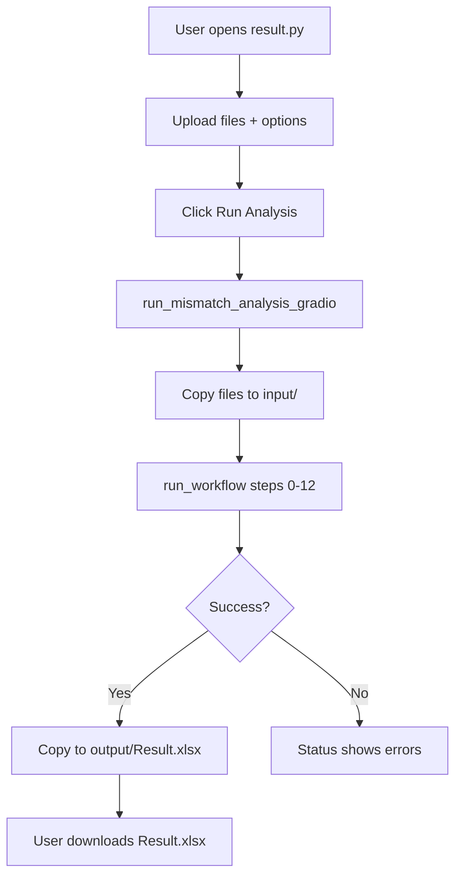
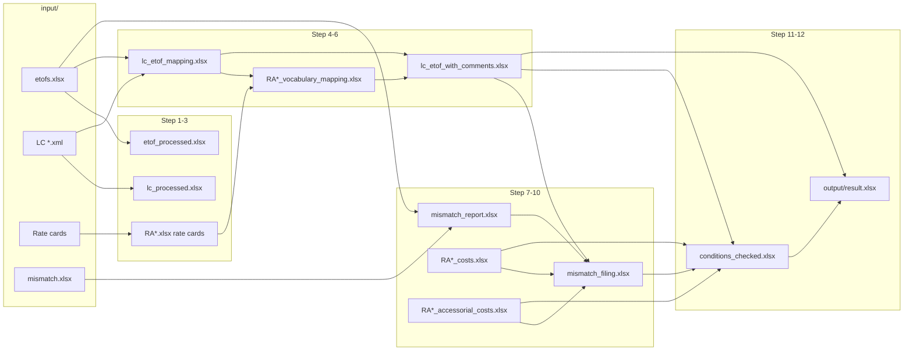

# Mismatch Analysis 2.0 — Project Overview

This document describes the **Mismatch Analysis 2.0** codebase end to end: what it does, how files relate, execution order, inputs/outputs, and where customizations live. It is written so someone new to the project can understand the full flow without reading every Python file first.

---

## Table of contents

1. [Purpose and business context](#1-purpose-and-business-context)
2. [High-level architecture](#2-high-level-architecture)
3. [Folder layout and artifacts](#3-folder-layout-and-artifacts)
4. [How to run the project](#4-how-to-run-the-project)
5. [Inputs and user options](#5-inputs-and-user-options)
6. [Outputs and deliverables](#6-outputs-and-deliverables)
7. [End-to-end process flow](#7-end-to-end-process-flow)
8. [Pipeline steps (detailed)](#8-pipeline-steps-detailed)
9. [Module reference](#9-module-reference)
10. [Customizations and configuration points](#10-customizations-and-configuration-points)
11. [Error handling and step criticality](#11-error-handling-and-step-criticality)
12. [Legacy and auxiliary scripts](#12-legacy-and-auxiliary-scripts)
13. [Dependencies and environment](#13-dependencies-and-environment)
14. [Glossary](#14-glossary)

---

## 1. Purpose and business context

The project automates **freight cost mismatch analysis**:

- Compare **invoice / ETOF shipment data** with **rate card** pricing (lanes, cost types, flat vs per-unit, MIN/MAX, accessorials).
- Link shipments to **Logistics Center (LC)** XML order data.
- Match each shipment to a **rate lane** on the correct **carrier agreement**.
- Explain **why** a cost on a mismatch report does or does not align with the rate card (a **Reason** column).
- Produce a polished **Excel result** for analysts: per-agreement tabs, pivot summaries, optional extra columns, and visual formatting.

The primary user interface is a **Gradio web app** (`result.py`). The same 12-step pipeline can also be driven programmatically via `run_workflow()`.

---

## 2. High-level architecture

```
┌─────────────────────────────────────────────────────────────────────────────┐
│                         result.py (Gradio UI + orchestrator)               │
│  • Upload files → input/                                                     │
│  • run_workflow() → steps 1–12                                               │
│  • Copy final file → output/Result.xlsx                                      │
└─────────────────────────────────────────────────────────────────────────────┘
                                      │
        ┌─────────────────────────────┼─────────────────────────────┐
        ▼                             ▼                             ▼
   input/                      partly_df/                      output/
 (user uploads)            (intermediate Excel)            (final download)
```

**Data philosophy:**

| Stage | Location | Role |
|-------|----------|------|
| Raw uploads | `input/` | ETOF, LC XML, rate cards, mismatch report, optional order export |
| Intermediate | `partly_df/` | Processed tables, mappings, matched lanes, cost extracts, filing, conditions |
| Final | `output/` | `result.xlsx` (and Gradio copy `Result.xlsx`) |

Most steps **read from `input/` or `partly_df/`** and **write to `partly_df/`**. Only the last cleaning/formatting step writes the analyst-facing workbook to `output/`.

---

## 3. Folder layout and artifacts

### 3.1 Directory structure

```
mismatches_2.0/
├── input/                 # User-provided source files (copied here by Gradio)
├── partly_df/             # Pipeline intermediates + debug logs (*.txt)
├── output/                # Final result.xlsx
├── info/                  # Pseudo-code / design notes (not executed)
│   ├── pseudo_code_vocabular.txt
│   ├── pseudo_code_part7_lc_etof_mapping.txt
│   └── pseudo_code_part4_rate_card.txt
├── result.py              # Main entry: Gradio + run_workflow()
├── part1_etof_file_processing.py
├── part2_lc_processing.py
├── part4_rate_card_processing.py
├── part7_optional_order_lc_etof_mapping.py
├── vocabular.py
├── matching.py
├── mismatch_report.py
├── rate_costs.py
├── rate_accesorial_costs.py
├── mismacthes_filing.py   # Note: filename typo "mismacthes"
├── conditions_checking.py
├── cleaning.py
├── result_transforming.py
├── canf_matching.py       # Legacy alternate matching (not in main workflow)
├── canf_vocabular.py      # Legacy alternate vocabulary
├── updating_errors.py     # Google Drive upload utility (standalone)
└── check_rules.py         # Empty / placeholder
```

### 3.2 Key intermediate files (`partly_df/`)

| File pattern | Created by | Used by |
|--------------|------------|---------|
| `etof_processed.xlsx` | Step 1 | Reference / debugging |
| `lc_processed.xlsx` | Step 2 | Reference / debugging |
| `{agreement}.xlsx` | Step 3 (`part4`) | Steps 5–6 (rate card data per agreement) |
| `lc_etof_mapping.xlsx` | Step 4 | Steps 5–6 |
| `{agreement}_vocabulary_mapping.xlsx` | Step 5 | Step 6 |
| `{agreement}_matched.xlsx` | Step 6 | Step 6 (`create_lc_etof_with_comments`) |
| `lc_etof_with_comments.xlsx` | Step 6 | Steps 10–12, extra columns |
| `mismatch_report.xlsx` | Step 7 | Step 10 (via filing) |
| `{agreement}_costs.xlsx` | Step 8 | Steps 10–11 |
| `{agreement}_accessorial_costs.xlsx` | Step 9 | Steps 10–11 |
| `mismatch_filing.xlsx` | Step 10 | Step 11 |
| `conditions_checked.xlsx` | Step 11 | Step 12 |
| `matching_output_*.txt` | Step 6 | Debug log |
| `conditions_debug_*.txt` | Step 11 | Debug log |

### 3.3 Final output (`output/`)

| File | Description |
|------|-------------|
| `result.xlsx` | Cleaned, formatted workbook (per agreement + pivot tabs) |
| `Result.xlsx` | Copy created by Gradio for download (same content) |

---

## 4. How to run the project

### 4.1 Gradio (recommended)

```bash
python result.py
```

- **Local:** opens `http://127.0.0.1` (default Gradio port).
- **Google Colab:** if `google.colab` is in `sys.modules`, binds `0.0.0.0`.

On startup, `result.py`:

1. Resolves project directory (`get_script_directory()`).
2. Adds it to `sys.path` and `chdir`s there (`setup_python_path()` — also runs on import).
3. Ensures `input/`, `output/`, `partly_df/` exist.
4. Launches the Gradio UI.

### 4.2 Individual modules (development / debugging)

Each pipeline module has `if __name__ == "__main__":` with hardcoded example filenames (e.g. `etofs gstar.xlsx`, `lc gstar.xml`). These are for **manual testing**, not the full workflow.

### 4.3 Programmatic full run

```python
from result import run_workflow

run_workflow(
    etof_file="etofs.xlsx",
    lc_files=["lc_shipper.xml"],           # or list of filenames in input/
    rate_card_files=["rate_card.xlsx"],
    mismatch_file="mismatch.xlsx",
    shipper_name="dairb",
    order_file=None,                       # optional — staged to input/ but not used in run_workflow body
    ignore_rate_card_columns=["Col1", "Col2"],
    include_positive_discrepancy=False,
    extra_columns=["Weight", "CBM"],
)
```

---

## 5. Inputs and user options

### 5.1 Required inputs (Gradio + workflow)

| Input | UI control | Stored in `input/` as | Purpose |
|-------|------------|----------------------|---------|
| **ETOF file** | File upload `.xlsx` | Renamed to `etofs{ext}` | Shipment master: origins, destinations, services, carrier agreement, ETOF numbers |
| **LC file(s)** | Multi file `.xml` | Original basename(s) | Order-level logistics data from LC XML (`ORDER` elements) |
| **Rate card file(s)** | Multi file `.xlsx` | Original basename(s) | Carrier rate cards (`General info`, `Rate card`, `Accessorial costs`, business rules) |
| **Mismatch report** | File upload `.xlsx` | Renamed to `mismatch{ext}` | Rows with cost discrepancies (ETOF, cost type, amounts) |
| **Shipper name** | Text | (parameter only) | Passed to vocabulary mapping as `shipper_id` for shipper-specific logic |

### 5.2 Optional inputs

| Input | UI control | Purpose |
|-------|------------|---------|
| **Order files export** | File upload `.xlsx` | Copied to `input/`; intended for optional order–LC–ETOF mapping (Step 4 module name references this; full order merge may depend on future wiring — `order_file` is **not** passed into step functions inside `run_workflow` today) |
| **Ignore rate card columns** | Comma-separated text | Columns excluded during vocabulary mapping (Step 5) |
| **Include positive discrepancy** | Checkbox (default off) | If **off**, mismatch report and filing keep **negative** discrepancies only; if **on**, all non-zero discrepancies |
| **Extra columns** | Checkbox group (17 choices) | Columns merged from `lc_etof_with_comments.xlsx` into final result (Step 12 via `cleaning` → `result_transforming`) |

### 5.3 Extra column choices (UI ↔ code)

Display names in Gradio map to source columns via `EXTRA_COLUMNS_ALIAS_MAP` in `result_transforming.py`:

| UI label | Source column in LC/ETOF data |
|----------|-------------------------------|
| Invoice entity | `INVOICE_ENTITY` |
| Carrier name | `CARRIER_NAME` |
| Destination postal code | `CUST_POST` |
| Origin postal code | `SHIP_POST` |
| Destination airport | `CUST_AIRPORT` |
| Equipment type | `CONT_LOAD` |
| Origin airport | `SHIP_AIRPORT` |
| Business unit name | `BU_NAME` |
| Transport mode | `TRANSPORT_MODE` |
| LDM | `LDM` |
| CBM | `CBM` |
| Weight | `WEIGHT` |
| DANGEROUS Goods | `DANGEROUS_GOODS` |
| Charge weight | `CHARGE_WEIGHT` |
| House bill | `HOUSE_BILL` |
| Master bill | `MASTER_BILL` |
| Roundtrip | `ROUNDTRIP` |

Matching is done on **ETOF number** between result rows and `lc_etof_with_comments.xlsx`.

---

## 6. Outputs and deliverables

### 6.1 Primary deliverable: `output/result.xlsx`

Produced by **`cleaning.py`** + **`result_transforming.py`**.

**Per carrier agreement (data tabs):**

- One sheet per agreement (name truncated/sanitized for Excel 31-char limit).
- Rows grouped visually by **cost type** (alternating row shading).
- **Cost type** shown only on the first row of each consecutive group (duplicates blanked).
- Columns removed from analyst view: `Carrier Agreement`, `Comment`, `Rate By`, `Applies If` (internal fields used upstream).
- Standard column renames (e.g. `ETOF_NUMBER` → `ETOF`, `SHIP_DATE` → `Shipment date`).
- Optional **extra columns** inserted before **Pre-calc. cost** column.

**Per agreement (pivot tabs):**

- Sheet named `{Agreement}_Pivot` (suffix `Pivot`).
- Summary: **Cost Type** × **Reason Pattern** × **Count**.
- Reason patterns are normalized categories (e.g. “The cost is not covered by rate card”, “Pre-calculated according to the rate card”).

**Formatting (openpyxl):**

- Blue header row on data sheets; green on pivot sheets.
- Thin borders, wrapped text, frozen header (`A2`).
- Auto column width (10–50 chars).
- Light blue fill on alternating cost-type row groups.

### 6.2 Gradio download

`output/Result.xlsx` — copy of the same file for the download widget.

### 6.3 Status text (Gradio only)

Human-readable log: validation, file copy paths, workflow return path, errors/warnings, last ~20 key messages.

---

## 7. End-to-end process flow

### 7.1 User journey (Gradio)



### 7.2 Orchestrator sequence (`run_workflow`)

Executed in **`result.py`** after validation (Step 0):

| Order | Step | Module | Fatal? |
|------:|------|--------|--------|
| 0 | Validate inputs | `result.validate_inputs` | Yes — returns `None` |
| 1 | ETOF processing | `part1_etof_file_processing` | Yes — raises |
| 2 | LC processing | `part2_lc_processing` | Yes — raises |
| 3 | Rate card processing | `part4_rate_card_processing` | Yes — raises |
| 4 | LC–ETOF mapping | `part7_optional_order_lc_etof_mapping` | No — warning only |
| 5 | Vocabulary mapping | `vocabular` | No — warning only |
| 6 | Matching | `matching` | No — warning only |
| 7 | Mismatch report | `mismatch_report` | No — warning only |
| 8 | Rate costs | `rate_costs` | No — warning only |
| 9 | Accessorial costs | `rate_accesorial_costs` | No — warning only |
| 10 | Mismatches filing | `mismacthes_filing` | No — warning only |
| 11 | Conditions checking | `conditions_checking` | **Yes — raises** |
| 12 | Cleaning + formatting | `cleaning` + `result_transforming` | **Yes — raises** |

Steps 4–10 can fail partially; the workflow still attempts later steps unless Step 11/12 fails. In practice, **Step 11 requires** outputs from earlier steps (`mismatch_filing.xlsx`, `lc_etof_with_comments.xlsx`, `*_costs.xlsx`).

### 7.3 Data dependency graph



---

## 8. Pipeline steps (detailed)

### Step 0 — Validation (`result.py`)

- Confirms required parameters and that files exist under `input/` (relative names after Gradio copy).
- Logs current working directory and `input/` listing for debugging.

---

### Step 1 — ETOF file processing (`part1_etof_file_processing.py`)

**Function:** `process_etof_file(file_path)`

**Reads:** `input/{etof_file}` (first row skipped).

**Transforms:**

- Renames duplicate geographic columns (Origin vs Destination country/postal/airport/city).
- Drops workflow columns: Match, Approve, Calculation, State, Issue, Currency/Value variants.
- Parses country codes from `"XX - Country name"` format.
- Extracts carrier agreement ID from strings like `RA20220420022 (v.12) - Active`.
- **SHIPMENT_ID enrichment:** if missing in ETOF, searches `input/` for mismatch files containing `'mismatch gstar'` in the name and maps `ETOF_NUMBER` → `SHIPMENT_ID`.

**Writes:** `partly_df/etof_processed.xlsx`

---

### Step 2 — LC file processing (`part2_lc_processing.py`)

**Function:** `process_lc_input(lc_input_param, recursive=False)`

**Reads:** One or more LC XML paths under `input/` (filename must start with `LC`, case-insensitive).

**Transforms:**

- Parses each XML; one row per `ORDER` element; columns = XML child tags + `filename`.
- Ensures columns exist: `SHIP_CITY`, `CUST_CITY`, `SHIP_STATE`, `CUST_STATE`.

**Writes:** `partly_df/lc_processed.xlsx`

---

### Step 3 — Rate card processing (`part4_rate_card_processing.py`)

**Function:** `process_multiple_rate_cards(rc_list)`

**Per rate card file:**

- Reads **General info** → agreement number.
- Reads **Rate card** sheet: trims columns, keeps black-font columns, extracts column **conditions** from comments / rows above headers.
- Processes **business rules** (postal zones, country regions, etc.).
- Saves multi-sheet workbook to `partly_df/{agreement_number}.xlsx` with sheets such as:
  - Rate Card Data
  - Conditions
  - Business Rules
  - Summary

**Writes:** `partly_df/RAxxxxxxxx.xlsx` (one per input rate card)

---

### Step 4 — LC–ETOF mapping (`part7_optional_order_lc_etof_mapping.py`)

**Function:** `process_lc_etof_mapping(lc_input_path, etof_path)`

**Logic:**

1. Re-process LC and ETOF (or use in-memory from prior steps conceptually — implementation calls processors again).
2. `map_etof_to_lc()`:
   - Prefer **SHIPMENT_ID** match between ETOF and LC when both have valid IDs.
   - Else match on **DELIVERY_NUMBER**.
   - Adds `ETOF #`, `Carrier agreement #`, `LC #` to LC rows.
3. Drops rows without ETOF #.
4. Saves **multi-tab Excel**: `All Data`, one tab per carrier agreement, optional `No Agreement`.

**Writes:** `partly_df/lc_etof_mapping.xlsx`

**Note:** Optional order file from UI is not wired in this orchestrated call; extended order mapping would be a customization point.

---

### Step 5 — Vocabulary mapping (`vocabular.py`)

**Function:** `process_all_rate_cards_from_mapping_file(mapping_filename="lc_etof_mapping.xlsx", ignore_rate_card_columns=..., shipper_id=shipper_name)`

**Logic:**

1. Read agreement tabs from `lc_etof_mapping.xlsx` (skip `All Data`, `No Agreement`).
2. For each agreement, find `partly_df/{agreement}.xlsx`.
3. Map LC/ETOF column names to rate card column names using:
   - Fuzzy string matching
   - Optional **sentence-transformers** semantic similarity if installed
4. Respects **ignore_rate_card_columns** list from UI.
5. Uses **shipper_id** for shipper-specific mapping rules where implemented.

**Writes:** `partly_df/{agreement}_vocabulary_mapping.xlsx` (sheets: ETOF, LC, Mapping, etc.)

---

### Step 6 — Matching (`matching.py`)

**Functions:** `run_matching_all_agreements()` then `create_lc_etof_with_comments()`

**Logic:**

1. Discover pairs: `{agreement}_vocabulary_mapping.xlsx` + `{agreement}.xlsx`.
2. For each agreement, `run_matching_for_agreement()`:
   - Match shipment rows to rate card **Lane #** using mapped columns.
   - Validate **business rules** (postal codes, regions, dates).
   - Store match outcome in **comment** field (lane info or mismatch reason).
3. `create_lc_etof_with_comments()`:
   - Copies `lc_etof_mapping.xlsx` structure.
   - Merges **comment** from `{agreement}_matched.xlsx` by ETOF #.
   - Updates `All Data` tab.

**Writes:**

- `partly_df/{agreement}_matched.xlsx`
- `partly_df/lc_etof_with_comments.xlsx`
- `partly_df/matching_output_{timestamp}.txt` (console mirror)

---

### Step 7 — Mismatch report (`mismatch_report.py`)

**Function:** `main(include_positive_discrepancy=...)`

**Logic:**

1. Load mismatch Excel from `input/` (orchestrator uses uploaded `mismatch*.xlsx`; standalone `main()` defaults to hardcoded name — workflow uses processed file name from Gradio).
2. Load/process ETOF via `process_etof_file`.
3. **Filter** mismatch rows to ETOF numbers present in processed ETOF.
4. Build report with standard columns (cost type, ETOF, shipment IDs, geography, pre-calc cost, invoice cost, discrepancy).
5. Filter discrepancies: if `include_positive_discrepancy=False`, drop positive discrepancy rows.

**Writes:** `partly_df/mismatch_report.xlsx`

---

### Step 8 — Rate costs analysis (`rate_costs.py`)

**Function:** `process_multiple_rate_cards(rc_list)`

**Logic:**

- Parses **Rate card** sheet structure: lanes, cost blocks, Flat / per unit / MIN / MAX markers.
- Builds `CostColumn` objects with **Applies If**, **Rate By**, price column indices.
- Exports lane-level rate data + cost conditions per agreement.

**Writes:** `partly_df/{agreement}_costs.xlsx`

---

### Step 9 — Accessorial costs analysis (`rate_accesorial_costs.py`)

**Function:** `process_multiple_rate_cards(rc_list)` (same entry name, different module)

**Logic:**

- Parses **Accessorial costs** tab: cost blocks, multipliers, rate-by, lane pricing, % over costs, valid-from/to dates.
- Uses `AccessorialCost` and `LaneData` dataclasses.

**Writes:** `partly_df/{agreement}_accessorial_costs.xlsx`

---

### Step 10 — Mismatches filing (`mismacthes_filing.py`)

**Function:** `main(include_positive_discrepancy=...)`

**Logic:**

1. Re-run mismatch report logic (via `get_mismatch_report()`).
2. Attach **Carrier Agreement #** from `lc_etof_with_comments.xlsx` (tab name = agreement per ETOF).
3. Load all `{agreement}_costs` and `{agreement}_accessorial_costs` cost name sets.
4. For each mismatch row, if **cost type** is not found on that agreement’s rate or accessorial data → set **Comment** (e.g. cost not on rate card).
5. Save **one tab per carrier agreement** (+ `No Agreement` if needed).

**Writes:** `partly_df/mismatch_filing.xlsx`

---

### Step 11 — Conditions checking (`conditions_checking.py`)

**Function:** `main(debug=False)`

**Large module (~3900 lines)** — core business rules engine.

**Inputs:**

- `mismatch_filing.xlsx` (all tabs)
- `lc_etof_with_comments.xlsx`
- `partly_df/{agreement}_costs.xlsx`
- `partly_df/{agreement}_accessorial_costs.xlsx`

**Per mismatch row:**

1. If **Comment** already set → use as **Reason**.
2. Else resolve **Cost type**, **ETOF**, **Rate By**, **Applies If** from cost conditions.
3. Evaluate **Applies If** against shipment fields in LC/ETOF (equals, not equals, starts with, contains).
4. If conditions pass, calculate expected price:
   - **PER SHIPMENT** → flat price from rate lane in comment.
   - Weight-based → use charge weight.
   - Measurement-based → lookup in MEASUREMENT columns (including parsed calculation strings).
   - Apply MIN/MAX caps.
   - Accessorial-specific paths (flat, %, date validity).
5. Emit detailed **Reason** strings (or categorized patterns used later in cleaning).

**Writes:** `partly_df/conditions_checked.xlsx` (tabs per agreement)  
**Logs:** `partly_df/conditions_debug_{timestamp}.txt` when debug enabled

**Critical:** Failure here **stops the workflow**.

---

### Step 12 — Cleaning and final result (`cleaning.py` + `result_transforming.py`)

**Function:** `cleaning.main(extra_columns=...)`

**Cleaning (`cleaning.py`):**

1. Load all sheets from `conditions_checked.xlsx`.
2. Per sheet:
   - Remove internal columns.
   - Deduplicate display of **Cost type** (consecutive groups).
   - Build **pivot** summary from **Reason** → **Reason Pattern** (`extract_reason_pattern()`).
   - Track row ranges per cost type for coloring.
3. Call `result_transforming.format_result_file()`:
   - Rename columns (`COLUMN_RENAME_MAP`).
   - Merge **extra_columns** from `lc_etof_with_comments.xlsx`.
   - Apply Excel styling.

**Writes:** `output/result.xlsx`

---

## 9. Module reference

| File | Role in production workflow |
|------|----------------------------|
| `result.py` | Bootstrap paths, Gradio UI, `run_workflow`, `run_mismatch_analysis_gradio` |
| `part1_etof_file_processing.py` | ETOF Excel normalization |
| `part2_lc_processing.py` | LC XML → DataFrame |
| `part4_rate_card_processing.py` | Rate card parse, conditions, business rules, per-agreement export |
| `part7_optional_order_lc_etof_mapping.py` | Link LC orders to ETOF / carrier agreement |
| `vocabular.py` | Column alignment LC/ETOF ↔ rate card |
| `matching.py` | Lane matching + comments file |
| `mismatch_report.py` | Filtered discrepancy table |
| `rate_costs.py` | Main rate card cost/lane extraction |
| `rate_accesorial_costs.py` | Accessorial tab extraction |
| `mismacthes_filing.py` | Agreement assignment + missing-cost comments |
| `conditions_checking.py` | Price logic and Reason generation |
| `cleaning.py` | Analyst-facing table cleanup + pivots |
| `result_transforming.py` | Column aliases, merge extras, Excel cosmetics |
| `canf_matching.py` | **Not** called by `run_workflow` — older CANF matching path |
| `canf_vocabular.py` | **Not** called by `run_workflow` — older vocabulary path |
| `updating_errors.py` | Standalone Google Drive upload for CANF project artifacts |
| `check_rules.py` | Empty file (reserved) |

---

## 10. Customizations and configuration points

### 10.1 User-facing (Gradio / `run_workflow` parameters)

| Parameter | Effect |
|-----------|--------|
| `shipper_name` | Passed to vocabulary mapping as `shipper_id` |
| `ignore_rate_card_columns` | List or comma-separated; skipped during vocab mapping |
| `include_positive_discrepancy` | Controls discrepancy sign filter in steps 7 and 10 |
| `extra_columns` | List of display names; merged in final Excel |

### 10.2 `result_transforming.py`

| Constant | Purpose |
|----------|---------|
| `COLUMN_RENAME_MAP` | Always applied friendly headers on result sheets |
| `EXTRA_COLUMNS_ALIAS_MAP` | UI label → source column; extend here for new optional fields |

### 10.3 `cleaning.py`

| Function | Purpose |
|----------|---------|
| `extract_reason_pattern()` | Maps long Reason text → short pivot categories; edit to change summary semantics |
| `columns_to_remove` in `process_and_save()` | Columns stripped before export |
| `deduplicate_cost_type()` | Controls how cost type repeats display |

### 10.4 `part1_etof_file_processing.py`

| Area | Customization |
|------|----------------|
| `columns_to_remove` | ETOF columns dropped on ingest |
| Mismatch file search | Hardcoded filter `'mismatch gstar'` for SHIPMENT_ID backfill — change for other shippers/files |

### 10.5 `part4_rate_card_processing.py`

| Area | Customization |
|------|----------------|
| Font color filtering | Only “black font” columns kept as active rate columns |
| Condition extraction | Comments, row above header, row 2 fallback |
| Business rules sheets | Geographic validation used in matching |

### 10.6 `vocabular.py`

| Area | Customization |
|------|----------------|
| `ignore_rate_card_columns` | Per-run exclusion list |
| `shipper_id` | Shipper-specific mapping behavior |
| Semantic matching | Optional `sentence-transformers` install |

### 10.7 `matching.py`

| Area | Customization |
|------|----------------|
| `normalize_value()` | Postal codes, case, underscores |
| `parse_date_flexible()` | Ship date formats for lane validity |
| Business rules integration | From `part4` |

### 10.8 `result.py` path detection

`get_script_directory()` searches Colab paths and cwd — extend `colab_paths` list for new deployment locations.

### 10.9 `updating_errors.py`

`GOOGLE_DRIVE_PATH` — hardcoded target folder for manual uploads of `input/`, `partly_df/`, `output/`.

---

## 11. Error handling and step criticality

### 11.1 Gradio layer

- Missing required upload → immediate error message, no workflow.
- File copy failures → error status, no workflow.
- Uncaught exception in `launch_workflow` → traceback in status textbox.

### 11.2 Workflow layer (`run_workflow`)

| Behavior | Steps |
|----------|-------|
| Return `None` | Step 0 validation failure |
| `raise` (workflow failed) | Steps 1–3, 11–12 |
| Log warning, continue | Steps 4–10 |

### 11.3 Practical implications

- If Step 6 fails, `lc_etof_with_comments.xlsx` may be missing → Steps 10–11 degrade or fail.
- If Steps 8–9 fail, condition checking lacks cost files → incomplete Reasons.
- Permission errors on Excel save often create `*_new.xlsx` alternate filenames (modules handle `PermissionError`).

### 11.4 `finally` block

`run_workflow` restores the original working directory after completion or failure.

---

## 12. Legacy and auxiliary scripts

### 12.1 CANF modules (`canf_matching.py`, `canf_vocabular.py`)

Older **Compare and Find** implementation:

- Single-rate-card oriented.
- Reads `partly_df/vocabulary_mapping.xlsx` style outputs.
- **Not imported** by `result.py` workflow.

Use when debugging or migrating old CANF flows; do not assume they stay in sync with `matching.py` / `vocabular.py`.

### 12.2 `updating_errors.py`

Interactive script to zip/upload `input/`, `partly_df/`, `output/` to Google Drive under `{Name} {Shipper} {date}`. Independent of mismatch pipeline.

### 12.3 `info/` pseudo-code files

Design notes for vocabulary, rate card, and LC–ETOF mapping — documentation only.

---

## 13. Dependencies and environment

### 13.1 Core Python packages

- `pandas` — data handling
- `openpyxl` — Excel read/write and styling
- `gradio` — web UI (`result.py`)
- Standard library: `xml.etree`, `pathlib`, `shutil`, `re`, `dataclasses`, etc.

### 13.2 Optional

- `sentence-transformers` + `scikit-learn` — semantic column matching in `vocabular.py` (falls back to fuzzy matching if missing)

### 13.3 Runtime assumptions

- Working directory set to project root (handled by `setup_python_path()`).
- Write access to `input/`, `partly_df/`, `output/`.
- Input Excel files follow expected templates (ETOF export, standard rate card layout with named sheets).

---

## 14. Glossary

| Term | Meaning |
|------|---------|
| **ETOF** | Shipment/export file with ETOF numbers, routes, services, agreements |
| **LC** | Logistics Center XML order feed |
| **Rate card** | Carrier Excel tariff (lanes, costs, accessorials, rules) |
| **Carrier agreement** | Identifier (e.g. `RA20220420022`) tying ETOF/LC rows to a rate card file |
| **Lane #** | Row identifier on rate card for a origin/destination/service combination |
| **Mismatch report** | Pre-built list of cost discrepancies to analyze |
| **Vocabulary mapping** | Column name alignment between shipment data and rate card |
| **Comment** | Lane / match metadata on LC–ETOF rows (from matching) |
| **Reason** | Human-readable explanation after conditions checking |
| **Reason pattern** | Short category for pivot summaries |
| **partly_df** | Intermediate workspace (not final deliverable) |
| **Positive discrepancy** | Invoice cost higher than pre-calculated (often excluded by default) |

---

## Quick reference: one-page flow

```
Upload → input/
  → ETOF + LC + Rate cards + Mismatch (+ options)
  → Map LC↔ETOF (by shipment or delivery)
  → Align columns to rate cards (per agreement)
  → Find rate lane + comment
  → Build filtered mismatch list
  → Extract rate + accessorial cost catalogs
  → Flag costs missing from rate card
  → Compute Reasons (price logic)
  → Clean + pivot + format
  → output/result.xlsx
```

---

*Document generated for the `mismatches_2.0` codebase. For UI field help, see the “Instructions & Information” accordion inside the Gradio app in `result.py`.*
